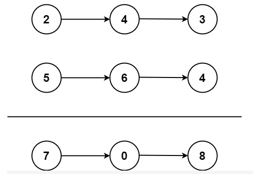

## LeetCode 002 两数相加
***
**Author：** `Labyrinthine Leo`&emsp;&emsp; **Init_time：**  `2021.01.08`

***

**Index Words：** `LeetCode 002`

***
**公众号：**`Leo的博客城堡`


***

###  题目

> - 两数相加
> - 题号：002
> - 难度：中等
> - https://leetcode-cn.com/problems/add-two-numbers/

给出两个 <b>非空</b> 的链表用来表示两个非负的整数。其中，它们各自的位数是按照 <b>逆序</b> 的方式存储的，并且它们的每个节点只能存储 <b>一位</b> 数字。

如果，我们将这两个数相加起来，则会返回一个新的链表来表示它们的和。

您可以假设除了数字 0 之外，这两个数都不会以 0 开头。

**示例1**：


```python
输入：l1 = [2,4,3], l2 = [5,6,4]
输出：[7,0,8]
解释：342 + 465 = 807.
```

**示例 2**：

```python
输入：l1 = [0], l2 = [0]
输出：[0]
```

**示例 3**：

```python
输入：l1 = [9,9,9,9,9,9,9], l2 = [9,9,9,9]
输出：[8,9,9,9,0,0,0,1]
```


###  Python实现

**思路**：按照竖式加法形式计算，取进位变量保存每一次累加计算后的进位值；主要难点在于要将链表逆向构建`LinkNode`输出。

- 状态：通过
- 执行用时: 72 ms, 在所有 C# 提交中击败了 87.76% 的用户
- 内存消耗: 14.8 MB, 在所有 C# 提交中击败了 13.59% 的用户

```python
# coding  : utf-8
# fun     : Leetcode 002 两数相加
# @Author : Labyrinthine Leo
# @Time   : 2021.01.08

# Definition for singly-linked list.
class ListNode:
    def __init__(self, val=0, next=None):
        self.val = val
        self.next = next

# -------------------- Solution --------------------
class Solution:
    def addTwoNumbers(self, l1: ListNode, l2: ListNode) -> ListNode:
    	carry_bit = 0
    	new_list = []
    	while l1 and l2:
    		new_list.append((l1.val + l2.val + carry_bit) % 10) # 记录该位新值
    		carry_bit = (l1.val + l2.val + carry_bit) // 10 # 记录进位
    		l1 = l1.next
    		l2 = l2.next
    	# 获取较小数
    	if l1 != None:
    		l = l1
    	else:
    		l = l2
    	while l:
    		new_list.append((l.val + carry_bit) % 10) # 记录该位新值
    		carry_bit = (l.val + carry_bit) // 10 # 记录进位
    		l = l.next
    	# 最后一位
    	if carry_bit != 0:
    		new_list.append(carry_bit)

    	link_list = None
    	for i in new_list[::-1]:
    		link_list = ListNode(i, link_list)
    	return link_list

# 测试样例
l = ListNode(9)
k = ListNode(9)
for i in range(6):
	l = ListNode(9, l)
for i in range(3):
	k = ListNode(9, k)
s = Solution()
x = s.addTwoNumbers(l, k)
while x:
	print(x.val)
	x = x.next
# print(s.addTwoNumbers(l, k))
```

