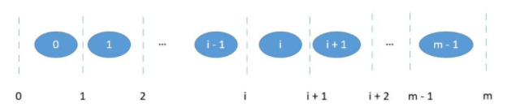
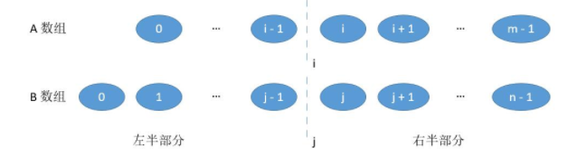
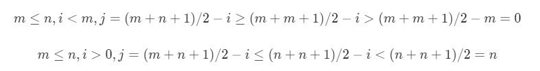
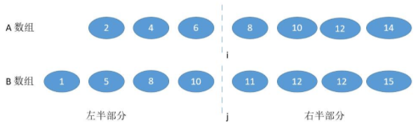
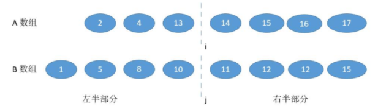
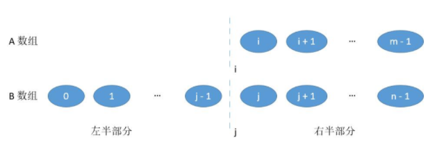
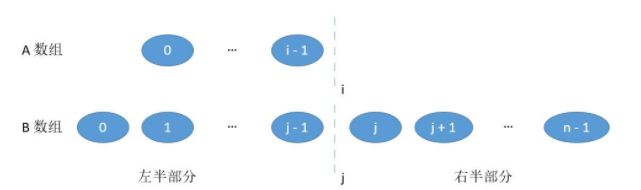

## LeetCode 004 寻找两个正序数组的中位数
***
**Author：** `Labyrinthine Leo`&emsp;&emsp; **Init_time：**  `2021.01.11`

***

**Index Words：** `LeetCode 004`

***
**公众号：**`Leo的博客城堡`


***

###  题目

> - 寻找两个正序数组的中位数
> - 题号：004
> - 难度：困难
> - https://leetcode-cn.com/problems/median-of-two-sorted-arrays/

给定两个大小为 m 和 n 的有序数组 nums1 和 nums2。

请你找出这两个有序数组的中位数，并且要求算法的时间复杂度为 O(log(m + n))。

你可以假设 nums1 和 nums2 不会同时为空。

<b>示例 1</b>:
```c
nums1 = [1, 3]
nums2 = [2]

则中位数是 2.0
```

<b>示例 2</b>:

```c
nums1 = [1, 2]
nums2 = [3, 4]

则中位数是 (2 + 3)/2 = 2.5
```

**提示**：
*` nums1.length ==m`
* `nums2.length == n`
* `0 <= m <= 1000`
* `0 <= n <= 1000`
* `1 <= m+n <= 2000`
* `-10^6 <= nums1[i], nums2[i] <= 10^6`


###  Python实现

#### 1、**归并排序1**

**思路**：归并排序思路很简单，使用双指针将两个数组进行按序比较大小，将小元素放置新的数组内，依次往复即可（需要考虑边界特殊情况，某个数组为空）；其中需要注意特殊条情况：某个数组全部遍历完，另一个数组可将剩余元素直接添加。对归并排序后的新数组进行个数奇偶判断对应返回中位数即可。

**时间复杂度**：`O(m+n)`
**空间复杂度**：`O(m+n)`

- 状态：通过
- 执行用时: 48 ms, 在所有 python3 提交中击败了 86.38% 的用户
- 内存消耗: 15 MB, 在所有 python3 提交中击败了 12.84% 的用户

```python
# coding  : utf-8
# fun     : Leetcode 004 寻找两个正序数组的中位数
# @Author : Labyrinthine Leo
# @Time   : 2021.01.11

class Solution:
    # def findMedianSortedArrays(self, nums1: List[int], nums2: List[int]) -> float:
    def findMedianSortedArrays(self, nums1, nums2):
        m = len(nums1)
        n = len(nums2)
        nums = [0] * (m+n) # 开辟新数组
        # 判断边界
        if m == 0:
        	if n % 2 == 0:
        		return (nums2[n // 2 - 1] + nums2[n // 2]) / 2
        	else:
        		return nums2[n // 2]

        if n == 0:
        	if m % 2 == 0:
        		return (nums1[m // 2 - 1] + nums1[m // 2]) / 2
        	else:
        		return nums1[m // 2]

        # 归并排序
        count = 0
        i = 0
        j = 0
        while count != (m+n):
        	# 边界条件
        	if i == m: 
        		while j != n:
        			nums[count] = nums2[j]
        			count += 1
        			j += 1
        		break
        	if j == n: 
        		while i != m:
        			nums[count] = nums1[i]
        			count += 1
        			i += 1
        		break

        	if nums1[i] < nums2[j]:
        		nums[count] = nums1[i]
        		count += 1
        		i += 1
        	else:
        		nums[count] = nums2[j]
        		count += 1
        		j += 1

        # 合并后数组判断
        if count % 2 == 0:
        		return (nums[count // 2 - 1] + nums[count // 2]) / 2
        else:
        	return nums[count // 2]

# 测试样例
nums1 = [1, 3]
nums2 = [2]
s = Solution()
print(s.findMedianSortedArrays(nums1, nums2))
```

#### 2、 **归并排序2**

**思路**：同上，只是直接使用现成的sort函数。

- 状态：通过
- 执行用时: 56 ms, 在所有 python3 提交中击败了 53.89% 的用户
- 内存消耗: 15.1 MB, 在所有 python3 提交中击败了 9.15% 的用户

```python
# 调用sort函数排序
class Solution:
    # def findMedianSortedArrays(self, nums1: List[int], nums2: List[int]) -> float:
    def findMedianSortedArrays(self, nums1, nums2):
    	m = len(nums1)
    	n = len(nums2)
    	nums1.extend(nums2) # 两个数组合并
    	nums1.sort() # 排序
    	if (m + n) & 1: # 奇数
    		return nums1[(m + n - 1) >> 1]
    	else:
    		return (nums1[(m + n) >> 1 - 1] + nums1[(m + n) >> 1]) / 2
```

#### 3、 **二分策略之划分数组**

**思路**：根据中位数的定义对两个数组进行组合划分为前后两部分，然后使其在满足条件下不断二分，直到达到结束条件取中间位置的数或数值。

1、一个长度为m的数组，如下图所示有m+1个位置可以划分。



2、可以对数组A和数组B在i和j位置处进行划分，然后合并为左半部分和右半部分。（如下图所示）



3、我们需要保证两个条件：

> * `i + j = m + n - i - j`（总数为偶数）或  `i + j = m + n - i - j + 1`(总数为奇数，左半部分比右半部分多一个，即让中位数再左边)
> * 左半部分最大的数小于等于左半部分最小的数，即`max(A[i-1], B[j-1]) <= min(A[i], B[j])`

当然其中第1个条件可以合并为`j = (m + n + 1) // 2 - i`，`//`为向下取整。并且其中`0 <= i <= m`，为了满足`0 <= j <= n`，必须保证`m <= n`。证明如下：



其中第2个条件，因为数组有序，所以只要保证`B[j-1] <= A[i]`和`A[i-1] <= B[j]`。

4、其中需要考虑的情况有：
* 在不越界的情况下，`B[j-1] > A[i]`



* 在不越界的情况下，`A[i-1] > B[j]`



* 边界情况，`i = 0 or j = 0`



* 边界情况，`i = m or j = n`




**时间复杂度**：`O(log(min(m, n)))`
**空间复杂度**：`O(1)`

- 状态：通过
- 执行用时: 48 ms, 在所有 python3 提交中击败了 86.19% 的用户
- 内存消耗: 14.9  MB, 在所有 python3 提交中击败了24.77% 的用户

```python
# 二分策略之划分数组
class Solution:
    # def findMedianSortedArrays(self, nums1: List[int], nums2: List[int]) -> float:
    def findMedianSortedArrays(self, nums1, nums2):
    	m, n = len(nums1), len(nums2)
    	if m > n: # 保证m<n
    		return self.findMedianSortedArrays(nums2, nums1)
    	k = (m + n + 1) // 2 # 中间变量，i+j=m+n-i-j或i+j=m+n-i-j+1
    	l, r = 0, m # 二分上下界
    	while l <= r:
    		i = (l + r) // 2 # n1数组划分位置
    		j = k - i # n2数组划分位置
    		if j != 0 and i != m and nums2[j-1] > nums1[i]: # i需要增大
    			l = i + 1
    		elif i != 0 and j != n and nums1[i-1] > nums2[j]: # i需要减小
    			r = i - 1
    		else: # 边界终止条件
    			if i == 0:
    				maxLeft = nums2[j-1]
    			elif j == 0:
    				maxLeft = nums1[i-1]
    			else: # 普通情况
    				maxLeft = max(nums1[i-1], nums2[j-1])
    			if (m + n) & 1: # 总长度为奇数
    				return maxLeft

    			if i == m:
    				minRight = nums2[j]
    			elif j == n:
    				minRight = nums1[i]
    			else: # 普通情况
    				minRight = min(nums1[i], nums2[j])

    			return (maxLeft + minRight) / 2
```

***

**参考文献**
* https://leetcode-cn.com/problems/median-of-two-sorted-arrays/solution/xiang-xi-tong-su-de-si-lu-fen-xi-duo-jie-fa-by-w-2/


